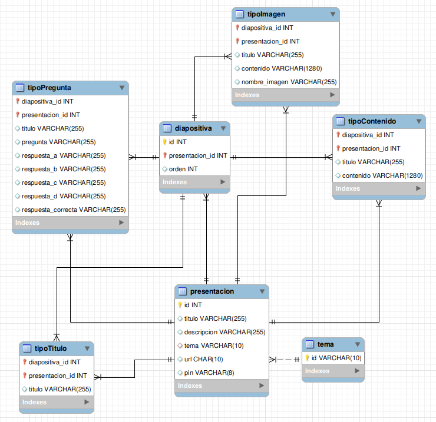

= MEMORIA

:toc-title: ÍNDICE
:figure-caption: Figura
:table-caption: Taula
:example-caption: Exemple
:revnumber: 1.12
:author: Alfred Perez, Emilio Fernandez, Salma Picazo
:doctype: book
:encoding: utf-8
:lang: es
:toc: left
:toclevels: 5
:sectnums:
:icons: font

== INTRODUCCIÓN
//Introducción miembros del equipo
=== Objetivo de la aplicación
El objetivo es crear una aplicación que permita crear una o más presentaciones con diferentes tipos de diapositivas. Va dirigida a todo tipo de público de una edad entre los 12 y los 65 años.  

== PLANIFICACIÓN Y SEGUIMIENTO
=== Semana 1
==== Alfred
- Creacion php (**save_p.php**) guardar presentaciones y diapositivas con su contenido y tipo.
- Creacion archivo **Vagrantfile** junto con las tablas de la base de datos.
- Creacion js (**save_p.js**) enviar datos al php para guardar presentaciones y diapositivas con su contenido y tipo.
- Modificación js (**crear_p.js**) para crear las diapositivas dinamicamente.
- Modificación html (**crear_p.html**) inputs y botones para enviar correctamente el formulario.
- Añadir codigos en el css + archivos para las fuentes.

==== Salma
- Diseño Mockups
- Diseño en Figma de la pantalla "home".
- Creacion del html **home.php**.
- Creacion del css **home.css** para darle estilo a la página.
- Creacion del js **home.js** para añadir funciones sobre las presentaciones, como visualizar los botones de editar, eliminar y clonar y mostrar una imagen para visualizar dicha presentación.

==== Emilio
- Generación de paleta de colores, fuentes e iconos.
- Diseño de Mockups.
- Diseño en Figma de las pantallas "home" y "crear_p".
- Creación del html **crear_p.html**.
- Creacion del css **crear_p.css** para darle estilo a la página.
- Creación del js **crear_p.js** para la generación dinámica de diapositivas.
- Actualización de los css **home.css** y **crear_p.css** para diseño final.

=== Semana 2
==== Alfred
- Funcionalidad guardar y editar antes del Refactorizar.

==== Salma
- Función de Eliminar Presentaciones desde home, **eliminar.php**.
- Despliegue de la aplicación en un servidor (Isard).
- Creación de la guía de estilos en Figma.

==== Emilio
- Creación de Modelo Vista Controlador.
- Refactorización de guardar y editar.
- Refactorización de BD.
- Refactorización de eliminar y cargar presentación en Home.

=== Semana 3

==== Alfred
- Diseño lista en Figma.
- Creacion funcionalidades:
    - Creacion de lista.
    - Actualizar lista dinamicamente por diapositivas.
    - Mostrar solo la diapositiva actual.
    - Enlazar items de la lista con sus diapositivas.
    - Eliminar diapositivas y mostrar la diapositiva anterior o posterior según su localicazión.

==== Salma
- Añadir Feedback al eliminar la presentación en la pantalla **home.php**.
- Pedir confirmación para guardar el progreso en la bbdd cuando se añade una nueva diapositiva.
- Añadir Feedback cuando se guarda una presentación.
- Diseño en Figma de la nueva diapositiva TipoImagen.
- Creacion nueva tabla tipoImagen + añadir la nueva diapositiva.

==== Emilio
- Refactorizar PHP, creando Modelos, Vistas y Controladores.
- Aplicar MVC a las funcionalidades actuales.
- Refactorizar directorio del proyecto, organizando MVC, assets, etc.
- Funcionalidad cargar presentación de la BD en el editor para seguir editando después de guardar.
- Refactorizar editor.css para visualizar temas con variables CSS.
- Hacer los temas persistentes en la BD y que se muestren al cargar.
- Diseño Figma de los Temas de presentación.
- Diseño Figma pantalla Previsualización.
- Funcionalidad Previsualización de las presentaciones.

=== Semana 4

==== Alfred
- Implementar editar diapositiva TipoPregunta.
- Refractorizar para arreglar guardado en BD de TipoPregunta.
- Arreglar funcion clase TipoPregunta para recoger los datos de la BD de la tabla TipoPregunta.
- Arreglar errores que han ido surgiendo en la implementacion.
- Arrelgar el cambio para mostrar respuesta correctas e incorrecta.
- Figma diapositiva TipoPregunta.

==== Salma
- Refactorizar código de la pantalla crear Presentación, listado.
- Creación del modelo de tipoPregunta.
- Creación en la bbdd de la tabla tipoPregunta.
- Creación de la diapositiva de tipoPregunta.
- Funcionalidad de guardado y lectura en la diapositiva de tipoPregunta.

==== Emilio
- Creación de diseños Figma de PIN, Publicar, Preview y Home.
- Funcionalidad de publicar presentaciones en Editor y Home.
- Funcionalidad de miniaturas en Preview.
- Funcionalidad de bloquar presentaciones con PIN.

== DISEÑO
=== Base de datos
La base de datos se compone de 7 clases, presentacion, diapositiva, tema, tipoTitulo, tipoContenido, tipoImagen y tipoPregunta.

   

La clase *presentacion* está compuesta de:

* Un identificador de tipo autonumerico.

* Un titulo, tipo String con máximo de 255 carácteres.

* Una descripción, String con máximo de 255 carácteres.

* Un tema, tipo String con máximo de 10 carácteres.

* Una url, tipo String con máximo de 10 carácteres.

* Un pin, de tipo String con máximo de 8 carácteres. 

La clase *diapositiva* está compuesta de:

* Un identificador de tipo autonumerico.

* Referencia al identificador de la clase presentación.

* Un orden, de tipo Int.

La clase *tema* está compuesta de:

* Un identificador de tipo autonumerico.

La clase *tipoTitulo* está compuesta de:

* Referencia al identificador de la clase diapositiva.

* Referencia al identificador de la clase presentación.

* Un título, de tipo String con máximo de 255 carácteres.

La clase *tipoContenido* está compuesta de:

* Referencia al identificador de la clase diapositiva.

* Referencia al identificador de la clase presentación.

* Un título, de tipo String con máximo de 255 carácteres.

* Un contenido, de tipo String con máximo de 1280 carácteres.

La clase *tipoImagen* está compuesta de:

* Referencia al identificador de la clase diapositiva.

* Referencia al identificador de la clase presentación.

* Un título, de tipo String con máximo de 255 carácteres.

* Un contenido, de tipo String con máximo de 1280 carácteres.

* Un nombre de la imagen, de tipo String con máximo de 255 carácteres.

La clase *tipoPregunta* está compuesta de:

* Referencia al identificador de la clase diapositiva.

* Referencia al identificador de la clase presentación.

* Un título, de tipo String con máximo de 255 carácteres.

* Una pregunta, de tipo String con máximo de 255 carácteres.

* Una respuestaA, de tipo String con máximo de 255 carácteres.

* Una respuestaB, de tipo String con máximo de 255 carácteres.

* Una respuestaC, de tipo String con máximo de 255 carácteres.

* Una respuestaD, de tipo String con máximo de 255 carácteres.

* Una respuesta correcta, de tipo String con máximo de 255 carácteres.

=== Interfícies

==== Sketching
Link a Figma https://www.figma.com/file/aAWb0YlNiNHMsdyzinLiPz/Home?type=design&node-id=0%3A1&mode=design&t=BGmqAhu9DtudaGBT-1[aquí]

==== Figma
Link a Figma https://www.figma.com/file/aAWb0YlNiNHMsdyzinLiPz/Home?type=design&node-id=0%3A1&mode=design&t=BGmqAhu9DtudaGBT-1[aquí]

=== Guía de estilos
Link a Figma https://www.figma.com/file/aAWb0YlNiNHMsdyzinLiPz/Home?type=design&node-id=0%3A1&mode=design&t=BGmqAhu9DtudaGBT-1[aquí]

== CONCLUSIÓN
En conclusión, durante el desarrollo de la aplicación hemos aprendido a diseñar y desarrollar una aplicación web desde su planificación hasta su mantenimiento. Además hemos mejorado nuestras habilidades técnicas, aprendiendo a solucionar errores durante el proceso. 

    
=== Línias futuras
- Poder mostrar correctamente las diapositivas con sus respectivas respuesas y su respuesta correcta.
- Mejorar diseño de la aplicación. 

=== Webgrafía

* https://www.w3schools.com/html/

* https://www.w3schools.com/css/

* https://developer.mozilla.org/es/docs/Web/CSS/CSS_flexible_box_layout/Basic_concepts_of_flexbox

